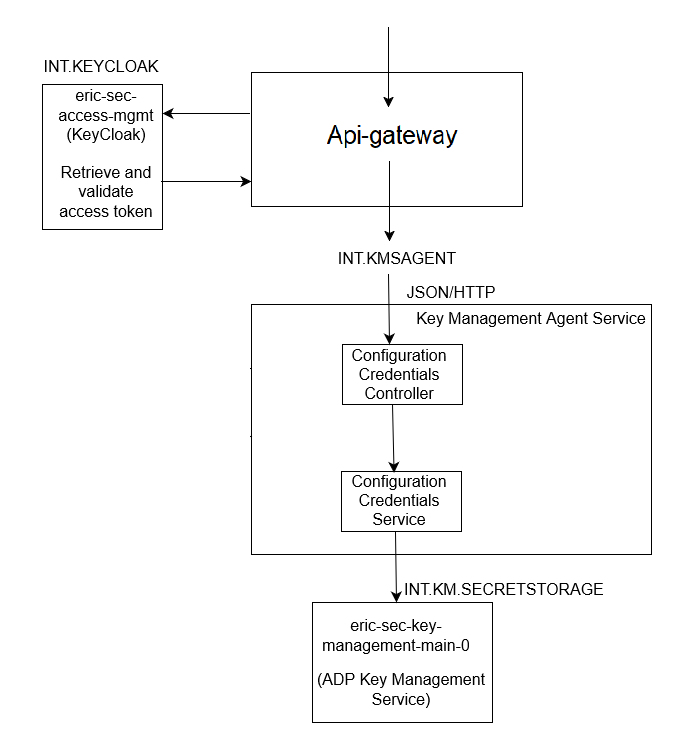
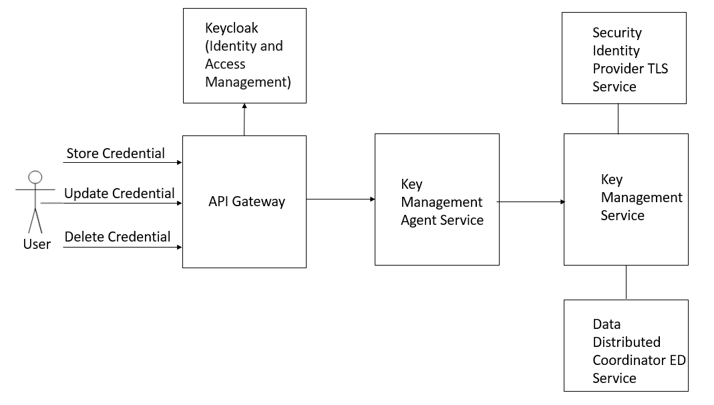

# Key Management Agent User Guide

[TOC]

## Overview

This document provides an overview of the *Key Management Agent* Service. This microservice provides a North Bound Interface (NBI) to allow an external client/user to store, delete and modify its sensitive configuration credentials in Key Management Service (KMS). It allows us to wrap, filter and protect the access to KMS for external users. Key Management Service (KMS) secures, stores, and tightly controls access to tokens, passwords, certificates, API keys, and other secrets in modern computing.

Key Management Agent provides Configuration Credential service. This service is used to store secure credential data as Vault Secrets in Key Management Service (KMS) where a configuration credential is any string value, used in client external configuration that you want to tightly control access to, such as API keys, usernames, passwords, etc. Sensitive credential data can be provided as input to OSS application use cases. An example of this is VNF/CNF password credentials used in Service Orchestrator configuration template files where the configuration is provided as input when creating network services. The credential data should not be stored and exposed in cleartext format in these external template configuration files.

### Role Prerequisites

Key Management Agent has a 'KmsAgentAdmin' role that should be associated with the user application composite roles. For example in Service Orchestrator (SO), the KmsAgentAdmin role is included in the SO application composite role 'SOProviderAdmin'. This allows users with SOProviderAdmin composite role assigned to also have the ability to create, update and delete credentials using Key Management Agent. The user must be associated with the KmsAgentAdmin role, either directly or through being associated with a composite role that includes the KmsAgentAdmin role.

### Supported Use Cases

This chapter gives an overview of the supported use cases.

| Use Case ID | Use Case Title                                                  | Compliance      |
  ------------------------------------------------------------------------------------------------------------------------------------------------------------------------------------------------------------------------------------ | --------------------------------------------------------------- |-----------------|
  | SO-KMSS01                                                                                                                                                                                                                     | Create Configuration Credential                                                     | Fully supported |
  | SO-KMSU01                                                                                                                                                                                                                     | Update Configuration Credential                                                     | Fully supported |
  | SO-KMSD01                                                                                                                                                                                                      | Delete Configuration Credential                                                       | Fully supported |

  The Configuration Credentials interface allows users to manage their secure credential data by providing an interface to Store, Update and Delete the credential data in KMS. The configuration credential service is tenant aware - only the tenant that stored a credential will be allowed to update and/or delete that credential.

### Architecture

Key Management Agent Service is a Spring boot based microservice which exposes REST API for administration of keys and configuration in ADP Key Management Service. ADP Key Management Service (KMS) secures, stores, and tightly controls access to tokens, passwords, certificates, API keys, and other secrets in modern computing. This functionality is provided by the Hashicorp Vault third-party product (3PP).

Key Management Agent currently exposes 'Configuration Credentials' to store secure credential data as Vault Secrets. The REST APIs exposed allow to store, update and delete Configuration Credentials. A configuration credential is any string value, used in client external configuration that you want to tightly control access to, such as API keys, usernames, passwords, etc. Credentials managed using the Key Management Agent 'Configuration Credential Service' are stored in KMS as a Vault 'secret'.

The following picture shows the *Key Management Agent* Service and its architectural context.


Figure 1 Architecture view of Key Management Agent

Key Management Agent  consists of the following components:

| ID  | Component Name       | Description                                                                                                                                |
| --- | -------------------- |--------------------------------------------------------------------------------------------------------------------------------------------|
| 1   | Configuration Credentials Controller     | Configuration Credentials Controller component exposes REST endpoints to store, update and delete Configuration Credentials. |
| 2   | Configuration Credentials Service     |  Configuration Credentials Service is used to handle REST requests and responses towards ADP Key Management Service (KMS).|

### Deployment View

*Key Management Agent* is packaged as a Docker container. It supports deployment in Kubernetes using Helm.
Key Management Agent deployment is supported on CCD/KaaS, and it makes use of CCD/KaaS services/components like Ingress, CoreDNS, Secrets, Configmap. External clients access REST endpoints via Ingress Controller which sends request to API Gateway. API Gateway after authentication redirects calls to backend.



Figure 2 Deployment view of Key Management Agent


To deploy the Service, refer to the [Deployment](#deployment), which:

- explains how to get started using the Key Management Agent Service in the supported environments.
- specifies configuration options for starting the Key Management Agent docker container.

If problems occur when using the service, refer to the [Troubleshooting section](#troubleshooting).

### Dimensioning and Characteristics

#### Dimensioning

To handle dimensioning configuration at deployment time, refer to the  Service Dimensioning section [Deployment](#deployment).

#### Scaling

The Key Management Agent Service does not support automatic scaling.

#### Upgrade - In Service Software Upgrade

Key Management Agent Service is robust and can maintain state between restarts. During an upgrade the service is unavailable for a short period of time. Upgrade should be performed when there are no ongoing backup and/or restore actions in progress or planned for the near future.

## Deployment

This section describes the operational procedures for how to deploy and upgrade the *Key Management Agent* Service in a Kubernetes environment with Helm. It also covers hardening guidelines to consider when deploying this service.

### Prerequisites

- *A running Kubernetes environment with helm support, some knowledge of the Kubernetes environment, including the networking detail, and access rights to deploy and manage workloads.*
- *Access rights to deploy and manage workloads.*
- *Availability of the kubectl CLI tool with correct authentication details. Contact the Kubernetes System
  Admin if necessary.*
- *Availability of the helm package.*
- *Availability of Helm charts and Docker images for the service and all dependent services (i.e. Identity and Access Management, API Gateway, Key Management Service, Service Identity Provider TLS, Distributed Coordinator ED).*

### Custom Resource Definition (CRD) Deployment

Key Management Agent Service does not have any CRD.

### Deployment in a Kubernetes Environment Using HelmD

This section describes how to deploy the service in Kubernetes using Helm and the `kubectl` CLI client. Helm is a package manager for Kubernetes that streamlines the installation and management of Kubernetes applications.

#### Preparation

Prepare helm chart and docker images. Helm chart in the following link can be used for installation:

[Helm chart used for installation][preparation]

[preparation]:https://arm.seli.gic.ericsson.se/artifactory/proj-eric-oss-drop-helm/eric-oss-key-management-agent/

### Pre-Deployment Checks for *Key Management Agent*

Ensure the following:

- The `<RELEASE_NAME>` is not used already in the corresponding cluster. Use `helm list` command to list the existing deployments (and delete previous deployment with the corresponding `<RELEASE_NAME>` if needed.

#### Helm Chart Installations of Dependent Services

##### Deploy the API Gateway

For more detailed information related to the API Gateway Service installation see [API Gateway](https://adp.ericsson.se/marketplace/api-gateway/helm).

##### Deploy the Identity and Access Management Service (Keycloak)

For more detailed information related to the Identity and Access Management Service installation see [IAM User Guide](https://adp.ericsson.se/marketplace/identity-and-access-management/documentation/latest/dpi/service-user-guide#deployment).
Deployment information can be found under Service User Guide >> Deployment

##### Deploy the Key Management Service

For more detailed information related to the Key Management Service installation see [Key Management Service](https://adp.ericsson.se/marketplace/key-management/documentation/latest/dpi/service-user-guide#deployment).
Deployment information can be found under Service User Guide >> Deployment.

##### Deploy the Service Identity Provider TLS

For more detailed information related to the Service Identity Provider TLS installation see [Service Identity Provider TLS](https://adp.ericsson.se/marketplace/service-identity-provider-tls/documentation/latest/dpi/service-user-guide#deployment).
Deployment information can be found under Service User Guide >> Deployment.

##### Deploy the Distributed Coordinator ED

For more detailed information related to the Distributed Coordinator ED installation see [Distributed Coordinator ED](https://adp.ericsson.se/marketplace/distributed-coordinator-ed/documentation/latest/dpi/service-user-guide#deployment).
Deployment information can be found under Service User Guide >> Deployment.

##### Helm Chart Installation of *Key Management Agent Service*

>**Note:** Ensure all dependent services are deployed and healthy before you
>continue with this step (see previous chapter).

Helm is a tool that streamlines installing and managing Kubernetes applications. *Key Management Agent Service* can be deployed on Kubernetes using Helm Charts. Charts are packages of pre-configured Kubernetes resources.

Users can override the default values provided in the values.yaml template of the helm chart. The
recommended parameters to override are listed in the following section:
[Configuration Parameters](#configuration-parameters).

##### Helm Chart Repository

Link to Helm Chart Repository for Key Management Agent: <https://arm.seli.gic.ericsson.se/artifactory/proj-eric-oss-drop-helm/eric-oss-key-management-agent>

##### Deploy the *Key Management Agent Service*

Install the *Key Management Agent Service* on the Kubernetes cluster by using the helm installation command:

```text
helm install <RELEASE_NAME> <CHART_REFERENCE> --namespace <NAMESPACE>  [--set <other_parameters>]
```

The variables specified in the command are as follow:

- `<CHART_REFERENCE>` A path to a packaged chart, a path to an unpacked chart directory or a URL.
- `<RELEASE_NAME>` String value, a name to identify and manage your helm chart.
- `<NAMESPACE>` String value, a name to be used dedicated by the user for deploying own helm charts.

Other_parameters example:

- `<IAM_HOSTNAME>` String value, DNS name of ingress to be used to reach IAM

For example:

```text
helm install eric-oss-key-management-agent ./helm-target/eric-oss-key-management-agent/eric-oss-key-management-agent-1.40.0-1.tgz --namespace test-service
--set replicas=1
--timeout 5m0s --wait
```

##### Verify the *Key Management Agent Service*  Availability

To verify whether the deployment is successful, perform the following steps:

*1.  Check if the chart is installed with the provided release name and in related namespace by using the following
command.*

```text
$helm ls -n <namespace>
```

*Chart status should be reported as “DEPLOYED”.*

*2.  Verify the status of the deployed helm chart.*

```text
$helm status <release_name> -n <namespace>
```

*Chart status should be reported as “DEPLOYED”. All Pods status should be reported as “Running” and
number of Deployment Available should be the same as the replica count.*

*3.  Verify that the pods are running by getting the status for your pods.*

```text
$kubectl get pods -n <namespace> -L role
```

For example:

```text
$kubectl create namespace test-service

$helm ls -n test-service

$kubectl get pods -n test-service
NAME                                                   READY     STATUS           RESTARTS         AGE
eric-sec-access-mgmt-0                                  1/1     Running             0              3d2h
eric-sec-key-management-main-0                          3/3     Running             0              3d2h
eric-sec-sip-tls-main-79c6554799-gdfdw                  2/2     Running             0              3d2h
eric-data-distributed-coordinator-ed-0                  1/1     Running             0              3d2h
eric-eo-api-gateway-b7b7984c4-gq75z                     1/1     Running             0              3d2h
```

*All pods status should be “Running”. All containers in any pod should be reported as “Ready”.*

### Configuration Parameters

#### Mandatory Configuration Parameters
| Variable Name                                               | Description                                                                                                                                                                                                                                                                           | Default Value         |
| ----------------------------------------------------------- | ------------------------------------------------------------------------------------------------------------------------------------------------------------------------------------------------------------------------------------------------------------------------------------- | --------------------- |
  global.hosts.gas                        | GUI Aggregated Service host detail                                                                                                                                                                                                                                                      |  |
| global.hosts.iam         |  IAM host detail                                                                                                                                                                                          |

#### Optional Configuration Parameters

The following table shows a selection of optional parameters. If not explicitly set (```text--set <parameter>=<value>```), the default values provided in the
helm chart are used.

| Variable Name                                               | Description                                                                                                                                                                                                                                                                           | Default Value         |
| ----------------------------------------------------------- | ------------------------------------------------------------------------------------------------------------------------------------------------------------------------------------------------------------------------------------------------------------------------------------- | --------------------- |
| imageCredentials.eric-oss-key-management-agent.imagePullPolicy         | When to pull the image from the registry URL. Possible values are 'Always' or 'IfNotPresent'                                                                                                                                                                                          |
| updateStrategy.type                                         | The Kubernetes update strategy of Key Management Agent Service                                                                                                                                                                                                                                                | RollingUpdate         |
| updateStrategy.rollingUpdate.maxUnavailable                 | Max unavailable pods during updates                                                                                                                                                                                                                                                   | 0                   |
| updateStrategy.rollingUpdate.maxSurge                       | Max number of pods over the desired amount                                                                                                                                                                                                                                            | 1                      |
| replicaCount                                                | The number of Key Management Agent instances                                                                                                                                                                                                                                               | 1                     |
| labels                                                      | Application specific labels                                                                                                                                                                                                                                       | {}                   |
| annotations                                                 | Application specific annotations, not set by default                                                                                                                                                                                                                                  | {}                    |
| nodeSelector                                                | Allows assignment of pods to specific nodes                                                                                                                                                                                                                                           | {}                    |
| affinity.podAntiAffinity                                    | Set inter-pod anti-affinity policy to Kubernetes scheduler for all pods in the service. See footnotes below ^(1)^        | "soft"                                                                                                                                                          |                 |
|podPriority.eric-oss-key-management-agent.priorityClassName              | priorityClassName, allows assigning priorities to POD's                                                                                                                                                                                                      | |
|tolerations                              | Node tolerations for the Key Management Agent pod. See footnotes below ^(2)^                                                                                                                                                                                                               |
| terminationGracePeriodSeconds                               | Time duration after process termination before they are forcibly killed                                                                                                                                                                                                               | 30                    |           |
| resources.eric-oss-key-management-agent.requests.memory                  | The requested amount of memory                                                                                                                                                                                                                                                        | 640Mi                  |
| resources.eric-oss-key-management-agent.requests.cpu                     | The requested amount of CPU                                                                                                                                                                                                                                                           | 125m
| resources.eric-oss-key-management-agent.requests.ephemeral-storage       | The requested amount of ephemeral-storage                                                                                                                                                                                                                                             |                                        |
| resources.eric-oss-key-management-agent.limits.memory                    | The maximum amount of memory allowed                                                                                                                                                                                                                                                  | 1Gi                  |
| resource.eric-oss-key-management-agent.limits.cpu                       | The maximum amount of CPU allowed                                                                                                                                                                                                                                                     | 500m                  |
| resources.eric-oss-key-management-agent.limits.ephemeral-storage         | The maximum amount of ephemeral-storage allowed                                                                                                                                                                                                                                       |
| resources.keycloakClient.limits.memory                      | The maximum amount of memory allowed                                                                                                                                                                                                                                                  | 100M                 |
| resources.keycloakClient.limits.cpu                         | The maximum amount of CPU allowed                                                                                                                                                                                                                                                     | 100m                  |
| resources.api-gateway-client.limits.memory                      | The maximum amount of memory allowed                                                                                                                                                                                                                                                  | 100M                 |
| resources.api-gateway-client.limits.cpu                         | The maximum amount of CPU allowed                                                                                                                                                                                                                                                     | 100m                  |
| resources.kms-access-setup.limits.memory                      | The maximum amount of memory allowed                                                                                                                                                                                                                                                  | 100M                 |
| resources.kms-access-setup.limits.cpu                         | The maximum amount of CPU allowed                                                                                                                                                                                                                                                     | 100m                  |
| probes.eric-oss-key-management-agent.livenessProbe.initialDelaySeconds | Number of seconds after the container has started before liveness probe is initiated (Not applicable if startup probe is used)                                                                                                                                                        | 60                   |
| probes.eric-oss-key-management-agent.livenessProbe.periodSeconds         | Interval in seconds how often the probe is performed                                                                                                                                                                                                                                  | 10                    |
| probes.eric-oss-key-management-agent.livenessProbe.timeoutSeconds        | Number of seconds after which the probe times out                                                                                                                                                                                                                                     | 10                     |
| probes.eric-oss-key-management-agent.livenessProbe.failureThreshold      | Number of consecutive failures for the probe to be considered failed after having succeeded                                                                                                                                                                                           | 3                     |
| probes.eric-oss-key-management-agent.readinessProbe.initialDelaySeconds  | Number of seconds after the container has started before readiness probe is initiated (Not applicable if startup probe is used)                                                                                                                                                       | 60                    |
| probes.eric-oss-key-management-agent.readinessProbe.periodSeconds        | Interval in seconds how often the probe is performed                                                                                                                                                                                                                                  | 10                    |
| probes.eric-oss-key-management-agent.readinessProbe.timeoutSeconds       | Number of seconds after which the probe times out                                                                                                                                                                                                                                     | 10                     |
| probes.eric-oss-key-management-agent.readinessProbe.failureThreshold     | Number of consecutive failures for the probe to be considered failed after having succeeded                                                                                                                                                                                           | 3                     |
| appArmorProfile.type                                       | Type of the apparmorProfile: oossible values are unconfined, runtime/default, localhost, "". If apparmorProfile is set to a valid value different from "", then the annotation container.apparmor.security.beta.kubernetes.io/eric-oss-key-management-agent is inserted with the specified values. | ""                   |
 


(1): "hard" specifies rules that must be met for a pod to be scheduled onto a node (just like nodeSelector but using a more expressive syntax). This might result in a minimum required nodes available, if hard is used as all pods will have to be scheduled to another node. While "soft" specifies preferences that the scheduler will try to enforce but will not guarantee

(2): The default tolerations value for the Key Management Agent pod:

```text
- key: node.kubernetes.io/not-ready
  operator: Exists
  effect: NoExecute
  tolerationSeconds: 0
- key: node.kubernetes.io/unreachable
  operator: Exists
  effect: NoExecute
  tolerationSeconds: 0
```

### Service Dimensioning

The service provides by default resource request values and resource limit values as part of the Helm chart. These values correspond to a default size for deployment of an instance. This chapter gives guidance in how to do service dimensioning and how to change the default values when needed.

#### Override Default Dimensioning Configuration

If other values than the default resource request and default resource limit values are preferred, they must be overridden at deployment time.

Here is an example of the helm install command where resource requests and resource limits are set:

```text
helm install eric-oss-key-management-agent https://arm.seli.gic.ericsson.se/artifactory/proj-eric-oss-drop-helm/eric-oss-key-management-agent/eric-oss-key-management-agent-1.40.0-1.tgz --namespace example-namespace  --set resources.requests.memory=5Mi
```

#### Use Minimum Configuration per Service Instance

Key Management Agent service has no minimum configuration per service instance defined.

#### Use Maximum (Default) Configuration per Service Instance

The maximum recommended configuration per instance is provided as default in the Helm chart. Both Resource Request values and Resource Limit values are included in the helm charts.

| Resource Type (Kubernetes Service) | Resource Request Memory | Resource Limit Memory | Resource Request CPU | Resorce Limit CPU |
| ---------------------------------- | ---------------------- | -------------------- | ------------------- | ----------------- |
| Service Instance -  KEYMNGT        | 640Mi                   | 1Gi                | 125m                | 500m              |

### Upgrade Procedures

**Note:** If any chart value is customized at upgrade time through the "--set" option of the "helm upgrade" command, all other previously customized values will be replaced with the ones included in the new version of the chart.
To ensure that any customized values are carried forward as part of the upgrade, consider keeping a versioned list of such values. That list could be provided as input to the upgrade command in order to be able to use the "--set" option without side effects.

To upgrade the Key Management Agent Service after a new version becomes available, run the helm upgrade command using the following syntax:

```text
helm upgrade <RELEASE_NAME> <CHART_REFERENCE>
```

To rollback the Key Management Agent Service to a previous version, run the helm rollback command using the following syntax:

```text
helm rollback <RELEASE_NAME> <RELEASE_REVISION>
```

## Security guidelines

### Operative Tasks

This service does not include any operative tasks.

#### External Ports

None

#### Internal Ports

The following ports are cluster internal ports and not exposed to the outside:

| Service or Interface name | Protocol | IP Address Type | Port | Transport Protocol | IP Version |
| ------------------------- | -------- | --------------- | ---- | ------------------ | ---------- |
| Rest API server           | HTTP     | OAM IP          | 8080 | TCP                | IPv4, IPv6 |

#### Certificates

Service uses certificates for System-Internal TLS-Based Communication. It also uses ADP Key Management Service certificates.

#### Security Events That Can Be Logged

| Security Events                                                                      | Status    |
| ------------------------------------------------------------------------------------ | --------- |
| 105 65-0164/00322 Base_log_002_m Log for Security Events                             | Compliant |
| 105 65-0164/00254 Base_log_004_m Rev B Configuration of security events to be logged | Compliant |

## Privacy User Guidelines

PTI value is less than 180.

## Operation and Maintenance

### Backup and restore

The service does not support any kind of backup and restore operation.

## Troubleshooting

This section describes the troubleshooting functions and procedures for the *Key Management Agent Service*.

### Prerequisite

- `kubectl` and `helm CLI` tool properly configured

### Installation

#### Verify Helm Chart deployed successfully

Command:

```text
helm list -a -n <namespace>
```

Sample Output:

```text
NAME                        NAMESPACE       REVISION    UPDATED                                     STATUS      CHART                                   APP VERSION
eric-oss-key-management-agent           test-service    1           2023-01-13 14:15:50.049078226 +0200 CEST    deployed    eric-oss-key-management-agent-1.40.0-1.tgz
```

#### Verify that the pods are up and running

Command:

```text
kubectl get pods --selector=app=eric-oss-key-management-agent -n <namespace>
```

Sample command:

```text
kubectl get pods --selector=app=eric-oss-key-management-agent -n test-service
```

Sample Output:

```text
NAME                                                         READY    STATUS     RESTARTS     AGE
eric-oss-key-management-agent-7bb9858649-vj5xt                1/1     Running     0          6m19s
```

If the status of the pods is not Running, then get the logs from the pods using the commands below:

```text
kubectl logs <pod name> -n <namespace> -c <container name> > <filename>
```

The command will generate a file with given filename and add the logs of the given container of the pod:

```text
kubectl logs eric-oss-key-management-agent-7bb9858649-vj5xt -n test-service > app.log
```

### Deletion of Release

#### Uninstall helm release

Command:

```text
helm uninstall <release name> -n <namespace>
```

Sample command:

```text
helm uninstall eric-oss-key-management-agent -n test-service
```

In case of failures in deleting the release, the namespace can be deleted to remove all the associated resources.

```text
kubectl delete namespace <namespace>
```

In case there is a failure in deleting the resources, they will have to be deleted individually.
List all resources in the namespace using command below:

```text
kubectl get all -n <namespace>
```

Delete the resource using command below:

```text
kubectl delete <resource> -n <namespace>
```

>**Note:** Delete in the following order - replicaset, services, deployments. Check if any resources left in the namespace by using the command given to list all resources above.

Delete the namespace using the command below:

```text
kubectl delete namespace <namespace>
```

### Health checks

Command:

```text
kubectl exec -it <pod-name> -c <container-name> -n <namespace> -- curl <URL>
```

Sample Command:

```text
kubectl exec -it eric-oss-key-management-agent -n esilped -- curl -Si http://eric-oss-key-management-agent:80/actuator/health
```

Sample Output:

```text
HTTP/1.1 200
Content-Type: application/vnd.spring-boot.actuator.v3+json
Transfer-Encoding: chunked
Date: Fri, 13 Jan 2023 11:08:17 GMT

{"status":"UP","groups":["liveness","readiness"]}
```

### Enable Debug Logging

Log level can be set during the initial installation or changed during upgrade with option:

```text
--set logLevel=debug
```

Only enable debug logging to troubleshoot a problem that can be reproduced. Debug logging may impact performance.

### Data Collection

The logs are collected from each pod using command:

```text
kubectl logs <pod-name> -n <namespace> -c <container-name> > <filename>
```

The detailed information about the pod are collected using command:

```text
kubectl describe pod <pod-name> -n <namespace>
```

The environment variables are listed using command:

```text
kubectl exec <pod-name> -n <namespace> -- env
```

### Bug Reporting and Additional Support

Issues can be handled in different ways, as listed below:

- For questions, support or hot requesting, see [Additional Support](#additional-support).

- To report faults, see [Bug Reporting](#bug-reporting).

#### Additional Support

For questions or support requests on Key Management Agent Service, use the [JIRA][Support_Ticket_jira] template to create a support ticket.

#### Bug Reporting

If there is a suspected fault, a support ticket should be raised. Use the [JIRA][Bug_jira] template to create it. Please clone the template and fill out the necessary information.

If it is confirmed that it's a bug, the ticket will be converted accordingly. The report must contain specific Key Management Agent Service information and all applicable troubleshooting information highlighted in the Troubleshooting and Data Collection.

### Recovery Procedure

This section describes how to recover the service in case of malfunction. Please refer [Troubleshooting](#troubleshooting) for details.

### KPIs Troubleshooting

Key Management Agent Service is a stateless service therefore this section is not applicable.

### Alarm Handling

This is not implemented in Key Management Agent Service.

## References

[Template for Bug/Support Ticket][Bug_Support_Ticket_jira]

[Bug_Support_Ticket_jira]: https://jira-oss.seli.wh.rnd.internal.ericsson.com/browse/IDUN-52766